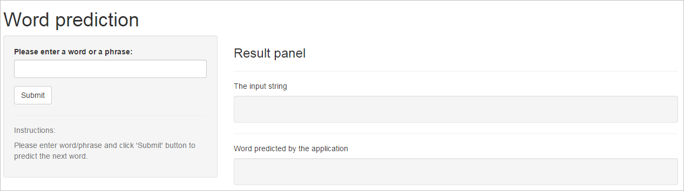

## Summary

Primary goal of this project is to build an application that will accept word or phrase as input and do the prediction of next word in a sentence by looking at the previous words entered.  

This application use text mining, natural language processing tools and techniques.  

Required data are downloaded from *[HC Corpora](http://www.corpora.heliohost.org/aboutcorpus.html)*, which is a collection of corpora for various languages freely available to download.  

--- 

## Application User Interface

*Application URL :* http://jaihokashi.shinyapps.io/CapstoneShinyApp  

* The application accepts 1, 2 and 3+ words.  
* If input words are more than 3, it will take the last 3 to predict the next word.  
* If no direct match found, then it will use backoff strategy to predict the next word.  

--- 

## Model and Implementation  

There following steps are performed to clean and train the data to predict the next word.  

* Preprocessing data  
. Removed whitespace Punctuation and Numbers.  
. Convert to lower case and Profane filter.   

* Generate 3 n-grams (bi-gram, tri-gram, quad-gram) data frame with frequencies.  

* Use NaiveBayes (from 'e1071' package) algortham to train, cross validate and test the data.  

* Use a back-off strategy and Lapsace smoothing if there is no direct match found in n-grams.

--- 

## Future enhancement  

For better prediction, I will implement following.  
* Linear Interpolation  
* End of word detection  
* Grammar checking  

--- 

